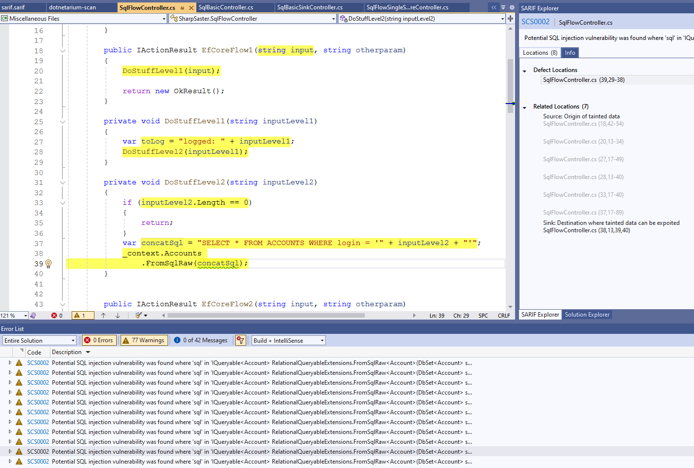

Install the following Visual Studio extension: `Microsoft SARIF Viewer 2022`

In Visual Studio:
- `Tools` -> `Open Static Analysis Results as SARIF`
- Choose the `.sarif` file with results

The extension will populate the `error list window`. 

Work with imported results in the error window as usual. The severity of DotnetariumSCS issues is set to `Warning`.

Double click on any issue with `SCS` prefix. It should open the SARIF Explorer window with additional information about the issue.

Use `Locations` tab to view related locations. Related locations will show data flow analysis visualization. It should help to triage the issue quicker.

